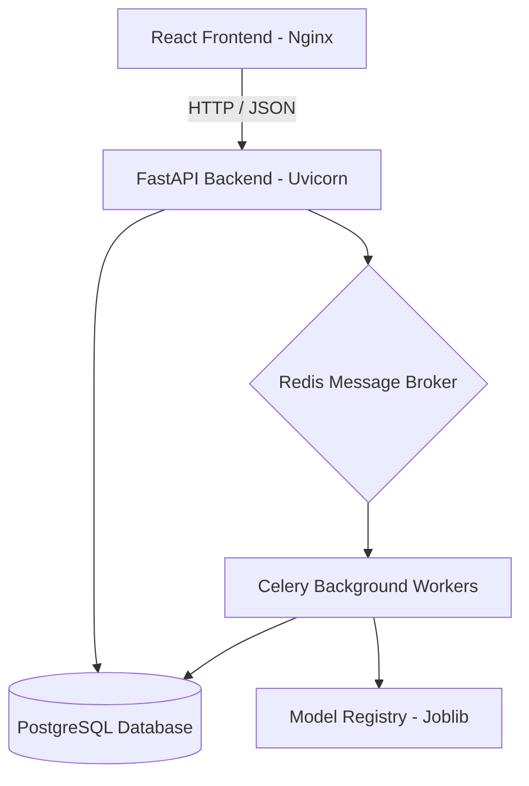
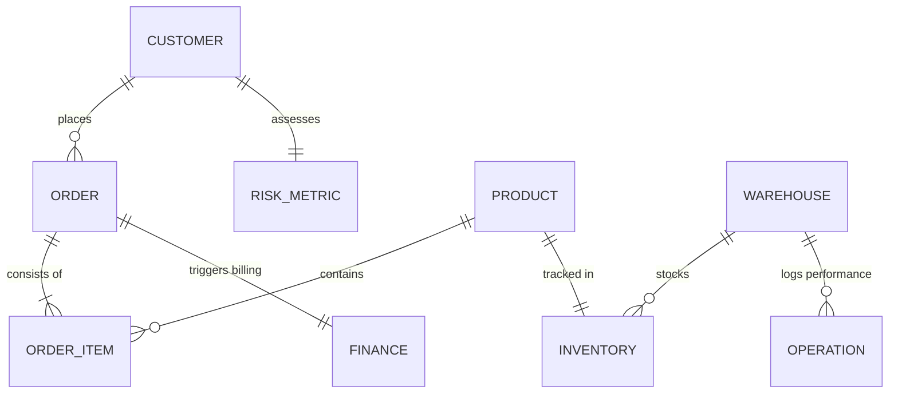
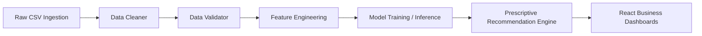
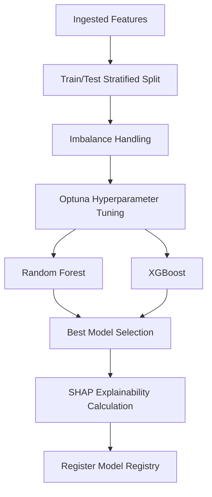
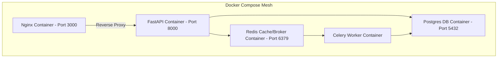

# Architecture Overview

## Goals

Build a modular enterprise SaaS platform that supports decision intelligence across sales, finance, customer, operations, inventory, and risk domains.

## Layered Architecture

### Presentation Layer
- React and TypeScript dashboard application
- Recharts visualizations
- Role-aware navigation and executive-grade UI surfaces

### API Layer
- FastAPI REST services
- Versioned routes under `/api/v1`
- Pydantic contracts for validation and OpenAPI generation

### Application Layer
- Business services orchestrating analytics, recommendations, and ML inference
- Shared cross-domain abstractions for alerts, exports, and scenario analysis

### Domain Layer
- Models for customers, products, orders, inventory, suppliers, marketing, employees, finance, and operations
- Repository interfaces for persistence isolation

### Infrastructure Layer
- PostgreSQL for transactional data
- Alembic for schema migrations
- Celery for asynchronous jobs and notification workflows
- Redis for broker & caching
- Docker Compose for local orchestration

---

## Diagrams

### 1. Platform Architecture Diagram

### 2. Entity-Relationship (ER) Diagram

### 3. Data Flow Diagram

### 4. Machine Learning Pipeline Diagram

### 5. Deployment Diagram

